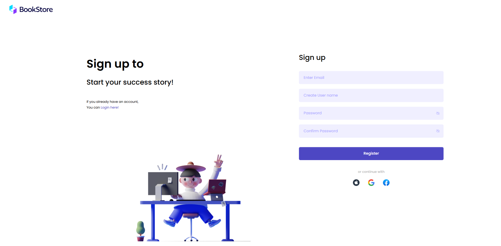
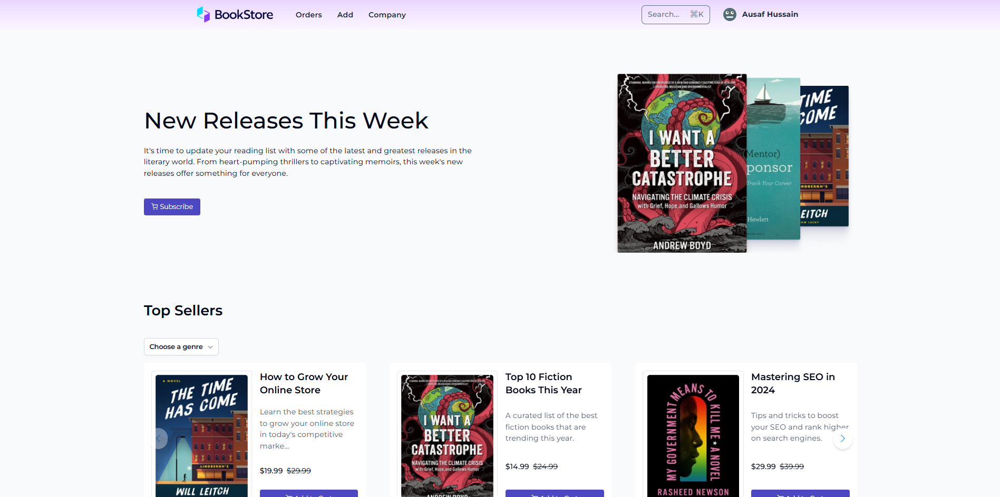

# mybookstore

Ecommerce Platform to buy books. Built using the MERN Stack.

## Overview

This project is a fully functional ecommerce platform where users can browse and purchase books. It features a backend built with Node.js, Express, and MongoDB, and a frontend built with React.

## Prerequisites

Before you begin, ensure you have the following installed:
- [Node.js](https://nodejs.org/) (version 14 or higher)
- [npm](https://www.npmjs.com/get-npm) or [yarn](https://classic.yarnpkg.com/en/docs/install/)

## Backend Setup

1. Create a `.env` file in the `backend` directory and add the necessary environment variables:

    ```plaintext
    DB_URL='mongodb+srv://...'         # Your MongoDB URL
    STRIPE_SECRET='...'               # Your Stripe secret key for payment feature
    FRONTEND_URL=http://localhost:5173  # Your frontend URL
    ```

2. Navigate to the `backend` directory and install dependencies:

    ```bash
    cd backend
    npm install
    ```

3. Start the backend server:

    ```bash
    npm run start:dev
    ```

## Frontend Setup

1. Create a `.env` file in the `frontend` directory and add the necessary environment variables:

    ```plaintext
    VITE_API_KEY='...'
    VITE_AUTH_DOMAIN='...'
    VITE_PROJECT_ID='...'
    VITE_STORAGE_BUCKET='...'
    VITE_MESSAGING_SENDER_ID='...'
    VITE_APP_ID='...'
    ```

    These values can be obtained from your Google Firebase project setup.

2. Navigate to the `frontend` directory and install dependencies:

    ```bash
    cd frontend
    npm install
    ```

3. Start the frontend server:

    ```bash
    npm run dev
    ```

## Deployment

### Deploying the Backend

1. Ensure your backend environment variables are correctly set for the production environment.
2. Deploy your backend code to your hosting service (e.g., Render, Heroku).

### Deploying the Frontend

1. Build the frontend for production:

    ```bash
    npm run build
    ```

2. Deploy the generated files in the `dist` directory to your static hosting service (e.g., Render, Vercel).

## Screenshots





